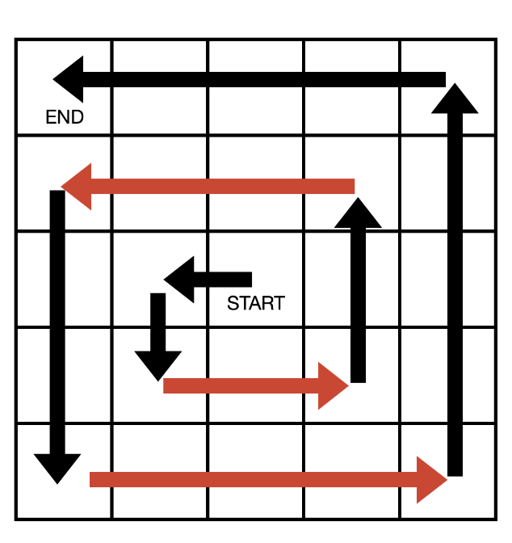

# 삼성 기출 Review


## 핵심 문제 로직 정리


### 회전

````python
#반 시계 함수
def rotate() :
    global MAP

    temp = [[0] * n for _ in range(n)]

    for i in range(n):
        for j in range(n):
            temp[n - 1 - j][i] = MAP[i][j]

    MAP = temp[:]


#반 시계
MAP = [[1,2,3], [4,5,6], [7, 8, 9]]

n = 3
temp = [[0] * 3 for _ in range(3)]

for row in range(3):
    for col in range(3):

        temp[n - 1 - col][row] = MAP[row][col]


MAP = temp[:]

print(MAP)


#시계 함수
def rotate() :
    global MAP

    temp = [[0] * n for _ in range(n)]

    for i in range(n):
        for j in range(n):
           temp[j][n - 1 - i] = MAP[i][j]

    MAP = temp[:]


# 시계 방향
MAP = [[1,2,3], [4,5,6], [7, 8, 9]]

n = 3
temp = [[0] * 3 for _ in range(3)]

for row in range(3):
    for col in range(3):

        temp[col][n - 1 - row] = MAP[row][col]


MAP = temp[:]

print(MAP)
````


#### 나선형 회전

##### 방식1 - 왼쪽 / 오른쪽 규칙(2개씩 잘라보기)

- 미로타워디펜스

1. 나선형 순회시 방향은 왼쪽, 아래, 오른쪽, 위 순서로 변함.

2. 각 방향에 대해서는 처음 1씩 이동하다가 방향이 왼쪽 혹은 오른쪽으로 바뀌게 되었을 때 동일한 방향에 대해 이동하게 되는 거리가 1씩 늘어남.

3. 단, 마지막 끝나는 부분에서는 그렇지 않음



```python
def search_spiral():
    # 나선이 돌아가는 순서대로
    # 왼쪽 아래 오른쪽 위 방향이 되도록 정의
    # 격자의 맨 중앙에서 좌 -> 하 -> 우 -> 상의 방향으로 나선형이 진행
    # 0 : 좌  / 1 : 하 / 2 : 우 / 3 : 하
    dxs = [0, 1, 0, -1]
	  dys = [-1, 0, 1, 0]
    # 시작 위치와 방향,
    # 해당 방향으로 이동할 횟수를 설정합니다.
    curr_x, curr_y = n // 2, n // 2
    move_dir, move_num = 0, 1

    while curr_x or curr_y:
        # move_num 만큼 이동
        for _ in range(move_num):
            curr_x += dxs[move_dir]
            curr_y += dys[move_dir]
            spiral_points.append((curr_x, curr_y))

            # 이동하는 도중 (0, 0)으로 오게 되면,
            # 움직이는 것을 종료
            if not curr_x and not curr_y:
                break

        # 방향을 바꾸기. 모둘려 연산을 통해서, 그 다음 방향이 다시 돌아올 수 있도록
        move_dir = (move_dir + 1) % 4
        # 만약 현재 방향이 왼쪽 혹은 오른쪽이 된 경우에는
        # 특정 방향으로 움직여야 할 횟수를 1 증가
        if move_dir == 0 or move_dir == 2:
            move_num += 1
```

.png)

##### 방식2 - visited배열 활용

* 마법사상어와 블리자드

````python
# 상 좌 하 우
dr = [-1, 0, 1, 0]
dc = [0, -1, 0, 1]

def matrix_to_list():

  	#격자의 중심 좌표 기록
    now_row = (N + 1) // 2 - 1
    now_col = (N + 1) // 2 - 1
    
    #visted 배열 초기화 및 초기값 현행화
    visited = [[False for _ in range(N)] for _ in range(N)]
    visited[now_row][now_col] = True
    now_dir = 0
    res = []

    #(0, 0)인 경우 제외
    while now_row != 0 or now_col != 0 :
      	# 델타 배열이 상 좌 하 우 이기에 + 1 을 사용
        # 역시 모둘려 연산을 통해, 방향이 다시 돌아 올 수 있도록 함. 
        new_row = now_row + dr[(now_dir + 1) % 4]
        new_col = now_col + dc[(now_dir + 1) % 4]

        #이미 간 곳 이라면, 방향을 바꾸지 않고 그대로 간다.
        if visited[new_row][new_col]:
          	#변화되지 않은 좌표로 계속 진행
            now_row = now_row + dr[now_dir]
            now_col = now_col + dc[now_dir]

        #가보지 않은 곳은 방향을 바꾼다.
        else:
          	#가보지 않은 곳으로 현재좌표를 옮기고 => 여기서 옮겼기 떄문에 
            # while now_row != 0 or now_col != 0 :
            # 	new_row = now_row + dr[(now_dir + 1) % 4]
            # 	new_col = now_col + dc[(now_dir + 1) % 4]
            # while 문의 반복속에서, new_row / new_col 의 now_row, now_col 이 변화해 새로운
            # 좌표로의 이동이 이루어질 수 있음.
            now_row = new_row
            now_col = new_col
            # 방향을 바꾼다. 
            now_dir = (now_dir + 1) % 4
        #나선형 모양으로 데이터들을 리스트에 넣는다
        res.append(MAP[now_row][now_col])
        visited[now_row][now_col] = True

    return res

````


* 마법사상어와 토네이도

````python

def solve(row, col):

    answer = 0
    visited = [[False] * n for _ in range(n)]
    dir = -1 #아무 방향 x, 방향은 0 ~ 4에 적용 되어 있음.
    while True :
        #(0,0)에 도착 => 토네이도의 이동을 멈춘다.
        if row == 0 and col == 0:
            break
        visited[row][col] = True
        next_dir = (dir + 1) % 4
        next_row = row + dr[next_dir]
        next_col = col + dc[next_dir]

        if visited[next_row][next_col] :
            #가려는 곳을 이미, 방문했기에 나선형을 만족하기 위해서, 다음 방향이 아닌, 이곳에 왓을때의 방향으로 다시
            next_dir = dir
            next_row = row + dr[next_dir]
            next_col = col + dc[next_dir]
		#여기서 ELSE를 쓰며 안되는 이유!? 여기는 미리 방향을 바꾸고 시작하니깐 
        answer += movingSand(next_row, next_col, next_dir)
        #여기서 dir이 바뀌게 되고...
        row, col, dir = next_row, next_col, next_dir

    return answer
````


#### 시계 / 반시계 방향 회전


* 예술성

**기본 공식 확인**

```python
시계    MAP[col][n-row-1] = MAP[row][col]
 
반시계  MAP[n-col-1][row] = MAP[row][col]
```


##### 방식 1 - 0, 0으로 가져오기

```python
# 회전
def rotate_square(start_row, start_col, square_n):

   for row in range(start_row, start_row + square_n) :
       for col in range(start_col, start_col + square_n):

            #(0, 0)으로 가져와서 변환 진행
            o_row, o_col = row - start_row, col - start_col

            debug = 1

            #좌표 변환 (회전)
            r_row = o_col
            r_col = square_n - o_row - 1

            debug = 1

            #다시 원래 좌표 위치로
            temp[r_row + start_row][r_col + start_col] = MAP[row][col]


def rotate():
    global MAP
    # temp 배열 초기화
    for row in range(n):
        for col in range(n):
            temp[row][col] = 0
    # 회전을 진행

    # 1 십자 모양 반시계 회전

    for row in range(n):
        for col in range(n):
            if row == n // 2:
                temp[n - col - 1][row] = MAP[row][col]

            elif col == n // 2:
                temp[col][row] = MAP[row][col]

    # 2 사각형 시계 회전
    sqaure_n = n // 2
    rotate_square(0, 0, sqaure_n)
    rotate_square(0, sqaure_n + 1, sqaure_n)
    rotate_square(sqaure_n + 1, 0, sqaure_n)
    rotate_square(sqaure_n + 1, sqaure_n + 1, sqaure_n)

    # temp 값을 다시 적용
    for row in range(n):
        for col in range(n):
            MAP[row][col] = temp[row][col]
```


##### 방식 2  - 4중 for문

```python
def rotate():
    # 회전한 뒤 옮길 2차원 배열
    rotated = [[0] * N for _ in range(N)]

    # 십자형 반시계 90도 회전.반시계 공식 : r, c => (N-1)-c, r
    # N//2 행을 N//2열에 밑에서부터 위로 저장
    for col in range(N):
        rotated[(N-1)-col][N//2] = art[N//2][col]
    # N//2 열을 N//2행에 왼쪽에서 오른쪽으로 저장
    for row in range(N):
        rotated[N//2][row] = art[row][N//2]

    # 십자형을 제외한 4개의 구역을 시계 90도 회전. 시계 공식 : r, c => c, (N-1)-r
    for s_r in [0, N//2+1]:
        for s_c in [0, N//2+1]:
            for r in range(N//2):
                for c in range(N//2):
                    rotated[s_r+c][s_c+N//2-1-r] = art[s_r+r][s_c+c]

    for i in range(N):
        art[i] = rotated[i][:]
```


* 회전하는 빙하

##### 방식 3 - temp배열 활용


````python
  	
  	#해당 격자에서 k개씩 잘라, 확인하겠다.
  	k = 2 ** level
    
    # 단계에 맞게, 주어진 2차원 배열을 좌상단부터 쪼갠다.
    # 그리고 회전까지
    for row in range(0, n, k):
        for col in range(0, n, k):
            temp = []
            #해당 범위(세로 기준)에 있는 것들
            for i in range(row, row + k):
              	# temp 배열에 담는다. 
                temp.append(MAP[i][col:col + k])

            #temp 배열을 활용한 90도 시계방향 회전

            for i in range(k):
                for j in range(k):
                    # 공식 적용
                    # 시계    MAP[col][n-row-1] = MAP[row][col]
										# 반시계  MAP[n-col-1][row] = MAP[row][col]
                    # row, col의 값만 추가 되었을 뿐,
                    MAP[row + j][col + k - 1 - i] = temp[i][j]
````


##### 방식 4 - 방식1 응용(굳이 0, 0으로 가져오지 않아)

```python
# 2^l 크기의 격자를 선택해서 들어왔다.
# 2^(l-1) 크기로 4등분된 빙하를 한 덩이씩 보면서 회전하는 함수
# d(방향) 에 맞춰 옮겨준다.
def rotating(sr, sc, half, d):
    for r in range(sr, sr+half):
        for c in range(sc, sc+half):
            nr = r + dr[d] * half
            nc = c + dc[d] * half
            rotated[nr][nc] = ice[r][c]


# 빙하를 선택하는 함수
# 2^N * 2^N의 빙하를 2^l * 2^l 만큼씩 선택한다.
# 그 안에서 2^(l-1) * 2^(l-1) 만큼씩 반시계 90'로 회전한다.
def iceberg_rotate(level):
    if level == 0:
        return
    l_len = 2 ** level
    h_len = l_len // 2

    # 4등분으로 반시계 방향으로 90' 회전하지만, 꼭 회전공식을 사용하지 않아도 된다.
    # 좌상, 우상, 우하, 좌하 격자 순대로 우 -> 하 -> 좌 -> 상의 방향으로 격자를 옮기는 것과 같은 행위다.
    # 이 생각을 떠올리긴 했지만, 4경우 모두 하나의 for 반복문 내에서 처리하려고 한 점이 더 돌아가게 만들었다.
    for start_r in range(0, length, l_len):
        for start_c in range(0, length, l_len):
            rotating(start_r, start_c, h_len, 0)
            rotating(start_r, start_c + h_len, h_len, 1)
            rotating(start_r+h_len, start_c+h_len, h_len, 2)
            rotating(start_r+h_len, start_c, h_len, 3)

    # 회전 사항 반영
    for r in range(length):
        ice[r] = rotated[r][:]
        rotated[r] = [0] * length
```

### **dfs 재귀  (전체 경우의 수 찾기)**

`기본 dfs 조합 암기 `

```python
#dfs_recur


def dfs(node):

    visited[node] = True
    print(node, end = '')

    for next in range(n):
        #노드마다 하나씪 찎고, 반복 돌려서 다 확인
        if not visited[next] and MAP[node][next]:
            dfs(next)


n, e = map(int, input().split())
visited = [False for _ in range(n)]
MAP = [[0 for _ in range(n)] for _ in range(n)]

values = list(map(int, input().split()))
#노드의 갈 수 있음을 이차원 배열에 표시
for i in range(e):

    start, end = values[i * 2], values[i * 2 + 1]
    MAP[start][end] = MAP[end][start] = 1

dfs(0)


# 조합 ver2

lst = [1, 2, 3, 4, 5]

target = 2

n = len(lst)

answer = []


def dfs_2(lev, cnt, temp):

    # 전체를 다 돌고
    if lev == n:

        # 해당 경우의 수의 요소의 갯수가, 내가 찾고자 하는 경우의 수 갯수와 같다면
        if cnt == target:
            answer.append(temp[:])

        return

    temp.append(lst[lev])
    dfs_2(lev + 1, cnt + 1, temp)
    temp.pop()
    dfs_2(lev + 1, cnt, temp)


dfs_2(0, 0, [])
print(answer)
```


#### 문제 적용

##### 바이러스 백신

```python
#전체 병원 중에서 m개의 가짓수를 뽑는 경우의 수 확인
hospital_comb = []


answer = INF

# 전체 병원을 선택하는 경우의 수 판단
def dfs(hospital_lst, candidate_lst, lev) :

    #전체를 다 돌고,
    if lev == len(hospital_lst):
        # 해당 경우의 수의 요소가, 내가 찾고자 하는 경우의 수 갯수와 같다면
        if len(candidate_lst) == m :
            hospital_comb.append(candidate_lst[:])
        return

    # lev은 자체는 증가 되는 것이 맞음. 
    # 이 dfs에서는 candidate_lst 자체에 값을 넣고 뺴면서, 값을 변화시키는 것. (원본의 cnt + 1 , cnt 부분)
    candidate_lst.append(hospital_lst[lev])
    dfs(hospital_lst, candidate_lst, lev + 1)
    candidate_lst.pop()
    dfs(hospital_lst, candidate_lst, lev + 1)


hospital = []
for row in range(n):
    for col in range(n):
        #병원 -2, 벽 -1로 변경   => 따로 visited배열을 만들지 않고, MAP에서 숫자를 카운팅 하기 위함?!
        if MAP[row][col] == 2:
            hospital.append((row, col))

print(hospital)
dfs(hospital, [], 0)

print(hospital_comb)
```


##### 팩맨

````python
'''
> 총 3칸을 이동

> 상하좌우의 선택지

> 총 64가지의 선택지 코스 (4가지 방향 * 4가지방향 * 4가지방향) why 총 3칸을 이동

> 이중 가장 몬스터를 가장 많이 섭취할 수 있는 방향으로 이동
'''
#팩맨 경로 구하기 (재귀함수를 통해 모든 경우의수 담기, 64가지)
def set_packman_routes(route):
    if len(route) == 3:
        packman_routes.append(route)
        return

    # 4방향으로 탐색이 가능.
    for i in range(4):
        set_packman_routes(route + [i])
        
        
# 팩맨 경로 모두 구해두기
set_packman_routes([])
````


### bfs  queue (최단거리 찾기)


````python
# 기본 bfs 형식
from collections import deque


def bfs(node):

    visited = [False for _ in range(n)]
    q = deque()
    visited[node] = True
    q.append((node))

    while q:

        now_node = q.pop()
        print(now_node, end = ' ')

        for next in range(n):
            if not visited[next] and MAP[now_node][next]:
                visited[next] =  True
                q.append((next))


n, e = map(int, input().split())
MAP = [[0 for _ in range(n)] for _ in range(n)]
values = list(map(int, input().split()))

#노드의 갈 수 있음을 이차원 배열에 표시
for i in range(e):

    start, end = values[i * 2], values[i * 2 + 1]
    MAP[start][end] = MAP[end][start] = 1

bfs(0)


# bfs - 최단거리


'''

입력

5
0 0 0 0 0
0 1 1 1 1
0 0 0 0 0
1 1 1 1 0
0 0 0 0 0
0 1 4 2

'''


# bfs 최단거리
from collections import deque

dr = [1, 0, -1, 0]
dc = [0, 1, 0, -1]


def bfs(s_row, s_col, d_row, d_col):
    visited = [[False for _ in range(n)] for _ in range(n)]
    q = deque()
    q.append((s_row, s_col, 0))
    visited[s_row][s_col] = True

    while q:
        now_row, now_col, dis = q.popleft()
        
        #도착지에 도착
        if now_row == d_row and now_col == d_col :
            return dis

        for i in range(4):

            next_row = now_row + dr[i]
            next_col = now_col + dc[i]

            if 0 <= next_row < n and 0 <= next_col < n:
                if not visited[next_row][next_col] and MAP[next_row][next_col] == 0:
                    visited[next_row][next_col] = True
                    q.append((next_row, next_col, dis + 1 ))
    return -1

n = int(input())
MAP = [list(map(int, input().split())) for _ in range(n)]

sr, sc, dr, dc = map(int, input().split())
print(bfs(sr, sc, dr, dc))


````


#### 문제적용


##### 바이러스 백신

````python
def bfs(hospital_lst) :

    global answer

    q = deque()
    visited = [[False] * n for _ in range(n)]
    time_maps = [[0] * n for _ in range(n)]

    # 초기에 선택된 병원들의 값들을 q에다가 넣어두고, visited 배열 체크
    # 지금 visited 배열이 False, True의 형태 이므로, 최단 거리를 구하기 위해서, cnt라는 변수와 해당 cnt를 기록할 수 있는 2차원 배열(time_maps)을 만들어
    # 최단거리를 기록
    for hos in hospital_lst :
        q.append((hos[0],hos[1], 0))
        visited[hos[0]][hos[1]] = True

    while q :

        now_row, now_col , cnt = q.popleft()

        for i in range(4) :
            next_row = now_row + dr[i]
            next_col = now_col + dc[i]

            #범위 체크 // 한번도 가지 않은 곳
            if 0 <= next_row < n and 0 <= next_col < n and not visited[next_row][next_col] :
                if MAP[next_row][next_col] == 0 or MAP[next_row][next_col] == 2:
                    q.append((next_row, next_col, cnt + 1))
                    visited[next_row][next_col] = True
                    time_maps[next_row][next_col] =  cnt + 1

    time = 0
    for row in range(n):
        for col in range(n):
            #이 경우는 모든 바이러스를 없애진 못한 경우, time_maps가 변하지 않고 그대로인 경우
            if MAP[row][col] == 0 and time_maps[row][col] == 0 :
                return

            if MAP[row][col] == 0:
                #각 케이스별 모든 바이러스를 없애는 데 걸리는 시간 
                time = max(time, time_maps[row][col])
    # 그 시간들 중 가장 잛은, 최단 시간을 구해 정답으로 출력
    answer = min(answer, time)
    
    
    #갈 수 있는 병원의 조합들을 bfs에 넣기
    for i in range(len(hospital_comb)) :
    bfs(hospital_comb[i])

````


##### 코드트리 빵

`````python
# bfs 함수 최단거리 (3. 베이스 캠프 찾기)
def bfs(idx, row, col) :
    #큐생성 = > 초기값 큐 삽입 = > visite배열 생성 => visted배열 초기값 체크 
    q = deque()
    q.append((0, row, col))
    visited = [[False] * (n) for _ in range(m)]
    visited[row][col] = True
    #최단거리이면서 베이스캠프가 될 수 있는 녀석들의 후보군 리스트 
    candidates = []

    #현재위치 기준으로 bfs를 돌면서, 최단거리로 갈 수 있는 베이스 캠프 조사
    while q :

        lev, row, col = q.popleft()

        #베이스캠프야?!  base 조건
        if MAP[row][col] == 1 :
            candidates.append((lev, row, col))
            # continue도 중요한 키워드, return이 아닌 건, 이 bfs함수를 통해 하나의 최단거리만 딱 보는 것이 아니라,
            # 같은 거리의 최단거리일 때, 행과 열의 위치를 통해 우선순위를 정하기 때문에, return 혹은 break를 통해 반복을 끝내는 것이 아니라
            # continue를 통해 다음 반복으로 넘어간다.
            continue

        # 4방향 탐색
        for i in range(4):
            
            #next_row /col 생성
            next_row = row + dr[i]
            next_col = col + dc[i]

            #이동후 항상 범위 체크
            if 0 <= next_row < n and 0 <= next_col < m :
                #g한번도 가지 않은 곳 이면서, 사람이 있지 않은 곳으로(임의로 내가 사람이 있는 곳은 2라 정의)
                if not visited[next_row][next_col] and MAP[next_row][next_col] != 2:
                    q.append((lev + 1, next_row, next_col))
                    visited[next_row][next_col] = True

    # 람다를 통해 정렬 -> 일단 거리가 짧을수록, 만약에 같은 거리라면 행, 그 다음에 열을 기준으로 정렬
    candidates.sort(key=lambda x : (x[0], x[1], x[2]))
    row, col = candidates[0][1], candidates[0][2] #조건에 맞는 가장 가까운 베이스 캠프 why?! 0번째(가장 맨앞)에 있는 값이 해당 조건을 가장 만족
    MAP[row][col] = 2 # 그곳은 현재 사람이 있다. why?! 문제에 이르길 베이스 캠프로는 바로 한번에 간다! 시간 소모 없이
    # 사람 위치 이동 - idx가 m번째 사람을 의미
    peoples[idx][0], peoples[idx][1] = row, col
`````


````python

        for j in range(4):

            #우선순위에 맞게 다음 row, col을 선택
            next_row = row + dr[j]
            next_col = col + dc[j]

            #선택된 next_row, next_col을 기준으로 다시 bfs를 돌려 편의점을 향해 가는 최단거리를 계산
            #이동 후 범위 체크
            if 0 <= next_row < n and 0 <= next_col < n:

                q = deque()
                q.append((0, next_row, next_col))
                visited_store = [[False] * n for _ in range(n)]
                visited_store[next_row][next_col] = True

                while q :
                    lev, cu_row, cu_col = q.popleft()
                    #편의점에 도착
                    if cu_row == stores[i][0] and cu_col == stores[i][1]:
                        # 이런식으로 lev를 만든 이유는 bfs로 최단거리를 구할 수 있지만, 하나의 점에서 점으로 이동하는 거리를 알기 위해서
                        # 변수를 하나 만들어 값을 누적시키면서, 그 값으로 전체적인 최단 거리 뿐만 아니라, bfs로도 특정 점과 점 사이의 거리를 구하기 위함.
                        if minDist > lev:
                            minDist = lev
                            min_row, min_col = next_row, next_col
                            break

                    for k in range(4):

                        next_cu_row = cu_row + dr[k]
                        next_cu_col = cu_col + dc[k]

                        #이동후 범위 설정

                        if 0 <= next_cu_row < n and 0 <= next_cu_col < n :
                            if not visited_store[next_cu_row][next_cu_col] and MAP[next_cu_row][next_cu_col] != 2 :
                                q.append((lev + 1, next_cu_row, next_cu_col))
                                visited_store[next_cu_row][next_cu_col] = True
````


##### 스타트 택시

`````python
# 택시 기준 최단거리에 있는 승객을 찾기 (택시 to 승객)
def bfs_find_person(taxi_row, taxi_col):

    q = deque()
    q.append((taxi_row, taxi_col))
    # visited 배열 안에다가 "최단거리"를 기록해야하기 때문에, False가 아닌 0값을 넣어, Integer로 관리
    # 또한 , True/False로 관리하는 것과 달리 , 초기값을 visited[row][col] = True의 작업을 하지 않아도 된다.
    visited = [[0] * N for _ in range(N)]
    min_distance = 1e9
    #최단 경로가 될 수 있는 승객의 row, col을 담을 리스트
    candidate = []

    while q:
        now_row, now_col = q.popleft()

        # 가지치기 1
        # visted 배열 안에다가, 최단거리를 기록
        # 현재 있는 최단 거리보다 더 길어?! 그럼 굳이 갈 필요가 없지..!
        if visited[now_row][now_col] > min_distance :
            break

        # 현재 좌표가, 손님이 출발지라면?! => 즉 택시가 손님이 있는 곳에 도착했다면, 
        # base 조건
        if (now_row, now_col) in person_departures :
            min_distance = visited[now_row][now_col]
            candidate.append((now_row, now_col))

        # else 존재 이유
        # => 아래에 있는 for문에서, 인접한(4개의 방향)으로 now_row/now_col에서 이동을 하는데, else가 없다면 이미 도착한 곳에서 또 이동을 하는건데
        # 이건 이상하자나
        else:
            for k in range(4):
                next_row = now_row + dr[k]
                next_col = now_col + dc[k]

                #이동 후 범위 체크,
                if 0 <= next_row < N and 0 <= next_col < N:
                    # 한번도 가보지 않은 곳 이면서, 벽이 아닌 곳
                    if not visited[next_row][next_col] and MAP[next_row][next_col] != 1 :
                        # 최단거리 => visited배열을 활용한
                        visited[next_row][next_col] = visited[now_row][now_col] + 1
                        q.append((next_row, next_col))


    if candidate:
        # candidate에 값이 들어오는 순간 이미 그 값은 최단거리를 보장, 행, 열, 기준으로 오름차순 정렬 => 이미 행 / 열 순으로 값을 넣었음
        candidate.sort()
        # 최단거리, row, col 반환
        return visited[candidate[0][0]][candidate[0][1]], candidate[0][0], candidate[0][1]
    else:
        return -1, -1, -1

`````


```python
# 승객 태운 장소부터, 도착지까지 최단거리로 가는 (택시with승객 to 도착지)
def bfs_destination(person_start_row, person_start_col, person_end_row, person_end_col) :
    q = deque()
    q.append((person_start_row, person_start_col))
    visited = [[0] * N for _ in range(N)]

    while q:
        now_row, now_col = q.popleft()

        #지금 온 곳이, 바로 도착지라면 ?!
        if (now_row, now_col) == (person_end_row, person_end_col) :
            break

        for k in range(4):
            next_row = now_row + dr[k]
            next_col = now_col + dc[k]

            # 범위 안에 있고
            if 0 <= next_row < N and 0 <= next_col < N :
                # 한 번도 가지 않은 곳 이면서, 벽이 아닌 곳
                if not visited[next_row][next_col] and MAP[next_row][next_col] != 1 :
                    visited[next_row][next_col] = visited[now_row][now_col] + 1
                    q.append((next_row, next_col))

    #while문이 끝났을 때의 now_row, now_col을 이런식으로 return이 가능
    return visited[now_row][now_col], now_row, now_col

```


##### 아기상어

````python
#먹을 먹이가 없을때를 조건으로 주고! 먹이가 없을 떄 까지 계속 반복문 반복! so While True
#bfs를 한번 돌리고 끝나는게 아님!
while True:

    #큐 생성 및 초기값 세팅
    q = deque()
    #큐에다가 이동시간까지 같이 넣어서! 비교!
    q.append((now_row, now_col, 0))
    #비짓배열 생성
    visited = [[False] * n for _ in range(n)]

    flag = 1e9
    fish = []
    # bfs 시작
    while q :

        start_row, start_col, count = q.popleft()

        #만약! 지금까지의 최소 이동 시간보다 더 시간이 오래 걸린다?! 탐색x
        if count > flag:
            break

        #이동 시작! 델타 배열 활용

        for i in range(4):
            next_row = start_row + dr[i]
            next_col = start_col + dc[i]

            # #이동의 조건 판단
            # if 0 <= next_row < n and 0 <= next_col < n:
            #     #한번도 가지 않은 곳 + 아기 상어보다 같거나 작은곳!
            #     if not visited[next_row][next_col] and MAP[next_row][next_col] < size:
            #         fish.append((next_row, next_col, count + 1))
            #         #flag를 둠으로써 굳이 최단거리가 아닌 물고기들을 탐색 x
            #         flag = count
            
            #장외 판단
            if next_row < 0 or next_row >= n or next_col < 0 or next_col >= n:
                continue

            #아기상어보다 값이 큰 곳 X, 한번 가본곳 X
            if MAP[next_row][next_col] > size or visited[next_row][next_col] :
                continue

            #여기 if문까지 통과하면 아기상어가 이동은 가능! 

            #먹을 수 있는 물고기들
            #빈칸이 아니어야 하고! 아기상어보다 같아도 안되고! 작아야 한다!
            if MAP[next_row][next_col] != 0 and MAP[next_row][next_col] < size:
                fish.append((next_row, next_col, count + 1))
                flag = count
                
            #일단 이동했으니! 아래와 같이 적는 것
            visited[next_row][next_col] = True
            q.append((next_row, next_col, count + 1))


    #bfs를 통해서 먹을 수 있는 물고기들 다 담고! 이제는 식사(조건에 맞게! 위에서 왼쪽)

    if len(fish) > 0 :
        fish.sort() # 이것만 하면 조건이 되는구나,,!
        #fish라는 이차원형태에서! 가장 맨앞에 있는 것! 정렬을 통해서 조건을 맞춰줫음
        row, col, move = fish[0][0], fish[0][1], fish[0][2]

        #먹은 물고기까지의 이동거리는 위에서 구했으니 거기까지의 이동거리를 총 이동거리에 계속해서 더해간다.
        moveCnt += move
        cnt += 1

        #식사 했으니 물고기 없다!
        MAP[row][col] = 0

        #만약에 내 몸의 사이즈 만큼 먹었다면! 상어의 크기가 증가해야한다.
        if cnt == size:
            size += 1
            cnt = 0
        # now_row, now_col을 기준으로 가까운 거리의 물고기 경우를 전부다 넣고,
        # 다시 bfs를 돌린다. 
        now_row = row
        now_col = col
    else:
        #While True문 종료시킨다.
        #위에 if절에서 더이상 먹을 물고기를 bfs를 통해서 담지 못했으니!
        break
````


### lambda /정렬

```python
data = [(1, 3), (0, 3), (1, 4), (1, 5), (0, 1), (2, 4)]

data.sort(key=lambda x : (x[1], x[0]))

print(data)

특정 기준으로 리스트를 정렬 할 수 있음. 

문제에선

- 현재 시간이 t분이고, t <= m 을 만족하다면, t번 사람은 자신이 가고 싶은 편의점과 가장 가까이 있는(최단거리) 베이스 캠프에 들어감. 이때도 가장 가까운 베이스 캠프가 여러가지인 경우 
 행 , 열 이 작은 순서로 들어감. 
 베이스 캠프로 이동하는 데에는 시간이 소요되지 않음.
 사람이 들어간 베이스 캠프는 다른 사람이 지나가지 못함.  
이런식으로 적어, 같은 최단거리의 경우의 수 중에서 정렬을 통해 해당 값을 추출하도록 함. 


- 거리가 가까운 물고기가 많다면, 가장 위에 있는 물고기, 그러한 물고기가 여러마리라면, 가장 왼쪽에 있는 물고기를 먹는다.
```


#### 문제적용 

##### 코드트리 빵

```python
# bfs 함수 최단거리 (3. 베이스 캠프 찾기)
def bfs(idx, row, col) :
    #큐생성 = > 초기값 큐 삽입 = > visite배열 생성 => visted배열 초기값 체크 
    q = deque()
    q.append((0, row, col))
    visited = [[False] * n for _ in range(m)]
    visited[row][col] = True
    #최단거리이면서 베이스캠프가 될 수 있는 녀석들의 후보군 리스트 
    candidates = []

    #현재위치 기준으로 bfs를 돌면서, 최단거리로 갈 수 있는 베이스 캠프 조사
    while q :

        lev, row, col = q.popleft()

        #베이스캠프야?!  base 조건
        if MAP[row][col] == 1 :
            candidates.append((lev, row, col))
            # continue도 중요한 키워드, return이 아닌 건, 이 bfs함수를 통해 하나의 최단거리만 딱 보는 것이 아니라,
            # 같은 거리의 최단거리일 때, 행과 열의 위치를 통해 우선순위를 정하기 때문에, return 혹은 break를 통해 반복을 끝내는 것이 아니라
            # continue를 통해 다음 반복으로 넘어간다.
            continue

        # 4방향 탐색
        for i in range(4):
            
            #next_row /col 생성
            next_row = row + dr[i]
            next_col = col + dc[i]

            #이동후 항상 범위 체크
            if 0 <= next_row < n and 0 <= next_col < m :
                #g한번도 가지 않은 곳 이면서, 사람이 있지 않은 곳으로(임의로 내가 사람이 있는 곳은 2라 정의)
                if not visited[next_row][next_col] and MAP[next_row][next_col] != 2:
                    q.append((lev + 1, next_row, next_col))
                    visited[next_row][next_col] = True

    # 람다를 통해 정렬 -> 일단 거리가 짧을수록, 만약에 같은 거리라면 행, 그 다음에 열을 기준으로 정렬
    candidates.sort(key=lambda x : (x[0], x[1], x[2]))
    row, col = candidates[0][1], candidates[0][2] #조건에 맞는 가장 가까운 베이스 캠프
    MAP[row][col] = 2
    # 사람 위치 이동
    peoples[idx][0], peoples[idx][1] = row, col
```


##### 아기상어

````python
#먹을 먹이가 없을때를 조건으로 주고! 먹이가 없을 떄 까지 계속 반복문 반복! so While True
#bfs를 한번 돌리고 끝나는게 아님!
while True:

    #큐 생성 및 초기값 세팅
    q = deque()
    #큐에다가 이동시간까지 같이 넣어서! 비교!
    q.append((now_row, now_col, 0))
    #비짓배열 생성
    visited = [[False] * n for _ in range(n)]

    flag = 1e9
    fish = []
    # bfs 시작
    while q :

        start_row, start_col, count = q.popleft()

        #만약! 지금까지의 최소 이동 시간보다 더 시간이 오래 걸린다?! 탐색x
        if count > flag:
            break

        #이동 시작! 델타 배열 활용

        for i in range(4):
            next_row = start_row + dr[i]
            next_col = start_col + dc[i]

            # #이동의 조건 판단
            # if 0 <= next_row < n and 0 <= next_col < n:
            #     #한번도 가지 않은 곳 + 아기 상어보다 같거나 작은곳!
            #     if not visited[next_row][next_col] and MAP[next_row][next_col] < size:
            #         fish.append((next_row, next_col, count + 1))
            #         #flag를 둠으로써 굳이 최단거리가 아닌 물고기들을 탐색 x
            #         flag = count
            
            #장외 판단
            if next_row < 0 or next_row >= n or next_col < 0 or next_col >= n:
                continue

            #아기상어보다 값이 큰 곳 X, 한번 가본곳 X
            if MAP[next_row][next_col] > size or visited[next_row][next_col] :
                continue

            #여기 if문까지 통과하면 아기상어가 이동은 가능! 

            #먹을 수 있는 물고기들
            #빈칸이 아니어야 하고! 아기상어보다 같아도 안되고! 작아야 한다!
            if MAP[next_row][next_col] != 0 and MAP[next_row][next_col] < size:
                fish.append((next_row, next_col, count + 1))
                flag = count
                
            #일단 이동했으니! 아래와 같이 적는 것
            visited[next_row][next_col] = True
            q.append((next_row, next_col, count + 1))


    #bfs를 통해서 먹을 수 있는 물고기들 다 담고! 이제는 식사(조건에 맞게! 위에서 왼쪽)

    if len(fish) > 0 :
        fish.sort() # 이것만 하면 조건이 되는구나,,!
        #fish라는 이차원형태에서! 가장 맨앞에 있는 것! 정렬을 통해서 조건을 맞춰줫음
        row, col, move = fish[0][0], fish[0][1], fish[0][2]

        #먹은 물고기까지의 이동거리는 위에서 구했으니 거기까지의 이동거리를 총 이동거리에 계속해서 더해간다.
        moveCnt += move
        cnt += 1

        #식사 했으니 물고기 없다!
        MAP[row][col] = 0

        #만약에 내 몸의 사이즈 만큼 먹었다면! 상어의 크기가 증가해야한다.
        if cnt == size:
            size += 1
            cnt = 0

        now_row = row
        now_col = col
    else:
        #While True문 종료시킨다.
        #위에 if절에서 더이상 먹을 물고기를 bfs를 통해서 담지 못했으니!
        break
````


### 특이한 델타배열 활용 (자료구조 세팅)

```sql
해당 case는 마법사상어와 토네이도, 어른 상어 등에서 미리 시물레이션의 이동 우선순위를 문제에서 설정한 경우. 
주어진 이동 우선순위에 따라 격자안에서 이동해야 함.

1) 내가 직접 델타 배열을 만들거나, 

2) 주어진 이동우선순위에 따라 dr, dc의 값으로 활용

-- 내가 저정하고자하는 데이터 구조의 모양을 미리 계획


```


#### 문제적용

##### 어른상어

````python
1. priorities : 미리 정해진 방향정보를 저장할 삼차원 리스트 , priorities[상어번호][이동방향][방향 별 우선순위] = 이동방향
=> 해당 방향으로 진행하지 못할 경우 , "방항 별 우선순위"의 인덱스 값을 변화시켜, 상어의 다음 이동방향을 구한다. 

prioritites = []
for i in range(m):
    temp = []
    for _ in range(4) :
        temp.append(list(map(int, input().split())))

    prioritites.append(temp)
    
2.smell : 현재 시간에 냄새의 상황을 보여주는 이차원 리스트 , smell [row][col] = [상어번호, 남은 냄새 시간] 
                                                 => smell[row][col][0] = 해당 row, col의 상어번호
                                                 => smell[row][col][1] = 해당 row, col의 남은 냄새 시간
  
smell = [[[0, 0]] * n for _ in range(n)]

3. data : 상어의 현재 위치를 나타내는 이차원 리스트(MAP), data[row][col] = row, col에 위치하고 있는 상어 번호

data = []

for _ in range(n):
    data.append(list(map(int, input().split())))
  

4. directions : 상어의 현재 방향, 1차원 리스트


    
# 모든 상어가 움직임

def move():
    #이동 결과를 담기 위한 임시 결과 테이블 초기화
    new_data = [[0] * n for _ in range(n)]
    #각 위치를 순회
    for row in range(n):
        for col in range(n):
            #상어가 존재
            if data[row][col] != 0:
                dir = directions[data[row][col] - 1] #현재 상어의 방향,, 왜 1을 빼지?! => 상어의 번호는 1번 부터 시작! but 초기 방향의 index는 0번부터 시작이니! -1을 한것!
                found = False
                #일단 냄새가 존재하지 않는 곳인지 확인하기
                for index in range(4):
                    # prioritites 자료구조 분석
                    # data[row][col] - 1 :  상어 번호. 데이터는 1 부터 시작이지만, prioritites는 0부터 시작하는 index 라서 -1을 함.
                    # dir-1 : 현재 상어의 이동방향.  해당 상어의 방향도 1부터 시작 하지만, prioritites 0부터 시작하는 index 라서 -1을 함.
                    # index : 현재 방향 별 이동 우선순위.
                    # prioritites[data[row][col] - 1][dir-1][index] - 1 에서 마지막에 -1을 하는 이유!? "상어번호별"의 "현재 방향"에 따른 "이동 우선순위" 도 1부터 시작하기에! 인덱스를 맞추기 위함.
                    next_row = row + dr[prioritites[data[row][col] - 1][dir-1][index] - 1]
                    next_col = col + dc[prioritites[data[row][col] - 1][dir-1][index] - 1]
                    #일단 장외인지 확인
                    if 0 <= next_row < n and 0 <= next_col < n:
                        if smell[next_row][next_col][1] == 0 : #냄새가 나지 않는 곳이라면
                            #해당 상어의 방향 이동시키기
                            directions[data[row][col] -1 ] = prioritites[data[row][col] - 1][dir - 1][index]
                            # (만약 이미 다른 상어가 있다면 번호가 낮은 상어가 들어가도록)
                            # 상어 이동시키기

                            if new_data[next_row][next_col] == 0:
                                new_data[next_row][next_col] = data[row][col]
                            else:
                                new_data[next_row][next_col] = min(data[row][col], new_data[next_row][next_col])
                            found = True
                            break
                if found:
                    continue
                #주변에 모두 냄새가 남아있다면, 자신의 냄새가 있는 곳으로 이동

                for index in range(4):
                    next_row = row + dr[prioritites[data[row][col] - 1][dir - 1][index] - 1]
                    next_col = col + dc[prioritites[data[row][col] - 1][dir - 1][index] - 1]
                    if 0 <= next_row < n and 0 <= next_col < n:
                        if smell[next_row][next_col][0] == data[row][col]: #자신의 냄새가 있는 경우라면
                            #해당 상어의 방향 이동 시키기
                            directions[data[row][col] - 1] = prioritites[data[row][col] - 1][dir - 1][index]
                            #상어 이동시키기
                            new_data[next_row][next_col] = data[row][col]
                            break
    return new_data
````


##### 마법사상어와 토네이도(청소는 즐거워)


> 토네이도가 x에서 y로 이동하면, y의 모든 모래가 비율과 α가 적혀있는 칸으로 이동한다. 비율이 적혀있는 칸으로 이동하는 모래의 양은 y에 있는 모래의 해당 비율만큼이고, 계산에서 소수점 아래는 버린다. α로 이동하는 모래의 양은 비율이 적혀있는 칸으로 이동하지 않은 남은 모래의 양과 같다. 모래가 이미 있는 칸으로 모래가 이동하면, 모래의 양은 더해진다. 위의 그림은 토네이도가 왼쪽으로 이동할 때이고, 다른 방향으로 이동하는 경우는 위의 그림을 해당 방향으로 회전하면 된다.


````python
#이동에 따른 모래의 이동 => 미리 토네이도의 이동 방향
sand_row = [
    #토네이도 이동 방향의 기준에 따른
    #좌
    [-1, 1, -2, 2, 0, -1, 1, -1, 1],
    #하
    [-1, -1, 0, 0, 2, 0, 0, 1, 1],
    #우
    [1, -1, 2, -2, 0, 1, -1, 1, -1],
    #상
    [1, 1, 0, 0, -2, 0, 0, -1, -1]
]

sand_col = [
    # 토네이도 이동 방향의 기준에 따른
    # 좌
    [1, 1, 0, 0, -2, 0, 0, -1, -1],
    # 하
    [-1, 1, -2, 2, 0, -1, 1, -1, 1],
    # 우
    [-1, -1, 0, 0, 2, 0, 0, 1, 1],
    # 상
    [1, -1, 2, -2, 0, 1, -1, 1, -1]
]
#실제 비율
rate = [1, 1, 2, 2, 5, 7, 7, 10, 10]


def movingSand(row, col, dir):
    answer = 0 #격자 밖의 모래양
    sand = MAP[row][col]
    total_ratio_sands = 0 #비율의 모래들이 모이는! sand에서 빼면 알파의 값이 되겟지

    #1. 비율 모래 이동
    #9가지 비율의 모래 날림.
    for i in range(9):
        next_row = row + sand_row[dir][i]
        next_col = col + sand_col[dir][i]
        ratio_sand = (sand * rate[i]) // 100
        total_ratio_sands += ratio_sand

        #격자 밖! value 값 더해줘야 한다.
        if not (0 <= next_row < n and 0 <= next_col < n):
            answer += ratio_sand
            continue
        # 격자 밖인 경우엔, 아래 로직을 탈 필요 없다.
        # 기존에 있던 모래에 더해진다. => 격자 밖의 모래를 모하러?!
        MAP[next_row][next_col] += ratio_sand

    #2. 비율 이외의 모래 이동
    #비율 외 알파로 가는 모래 이동 => 정정당당히 좌 하 우 상의 이동
    next_row = row + dr[dir]
    next_col = col + dc[dir]
    a = sand - total_ratio_sands
    #격자 밖
    #알파 마저도, 격자 밖으로 이동할 수 있다.
    if next_row < 0 or next_row >= n or next_col < 0 or next_col >= n :
        answer += a
    else:
        # 기존에 있던 모래에 더해진다.
        MAP[next_row][next_col] += a
    #기존에 자리에 있던 모래가, 알파와 비율의 모래로 전부 다 이동했으니, 0으로 바꿔준다.
    MAP[row][col] = 0
    return answer
````


##### 마법사상어와 파이어볼

````python
1. 파이어볼의 이동

모든 파이어볼이 자신의 방향 di로 속력 si칸 만큼 이동한다.
이동하는 중에는 같은 칸에 여러 개의 파이어볼이 있을 수도 있다.

파이어볼의 방향은 어떤 칸과 인접한 8개의 칸의 방향을 의미하며, 정수로는 다음과 같다.

7	0	1
6	 	2
5	4	3


dr = [-1, -1, 0, 1, 1, 1, 0, -1]
dc = [0, 1, 1, 1, 0, -1, -1, -1]


````


##### 마법사상어와 비바라기

1. 구름의 이동방향 미리 델타 배열 세팅

````python
#구름 이동 방향
dr = [0, -1, -1, -1, 0, 1, 1, 1]
dc = [-1, -1, 0, 1, 1, 1, 0, -1]

#초기 구름 세팅
cloud = [[n-1, 0], [n-1, 1], [n-2, 0], [n-2, 1]]
````


### 생각하기 어려웠던 로직 및 자료구조 세팅


#### 문제적용


##### 싸움땅 

1. append, del를 통해, 이차원배열의에서 하나의 row/col이 하나의 값이 아닌 lst 였을 때의 자료구조 세팅

````python
guns = [[0] * n for _ in range(n)] #하나의 값으로

guns = [[[] for _in range(n)] for _ in range(n)] # 이차원 배열에서의 하나의 row/col이 lst인 경우
````


2. 위의 자료구조에서 lst를 이차원 배열의 값으로 함으로 인해 발하는 append와 index를 통한 최대값 구하기

```python
player[player_num][4] = max(guns[nx][ny]) #가장 공격력이 센것을 한 사용자가 얻었다, 

del guns[nx][ny][guns[nx][ny].index(max(guns[nx][ny]))]
# 이미 얻은 가장 쎈 공격력의 무기를 삭제. 이때 del 키워드를 통해 한개의 요소를 삭제

#해당 요소를 선택할 때, 가장 큰 값(value)와 같은 값의 인덱스를 반환
```


##### 아기상어


1. flag 값을 통한 bfs에서의 가지 치기 

````python
flag값을 bfs의 count값(최단거리)과 비교해, 계속해서 q에서 pop되는 count값과 지금까지의 최단거리로 갱신한 flag값과 비교해 불필요한 탐색을 안하게 됨. 

while True:

    #큐 생성 및 초기값 세팅
    q = deque()
    #큐에다가 이동시간까지 같이 넣어서! 비교!
    q.append((now_row, now_col, 0))
    #비짓배열 생성
    visited = [[False] * n for _ in range(n)]

    flag = 1e9
    fish = []
    # bfs 시작
    while q :

        start_row, start_col, count = q.popleft()

        #만약! 지금까지의 최소 이동 시간보다 더 시간이 오래 걸린다?! 탐색x
        if count > flag:
            break

        #이동 시작! 델타 배열 활용

        for i in range(4):
            next_row = start_row + dr[i]
            next_col = start_col + dc[i]

            # #이동의 조건 판단
            # if 0 <= next_row < n and 0 <= next_col < n:
            #     #한번도 가지 않은 곳 + 아기 상어보다 같거나 작은곳!
            #     if not visited[next_row][next_col] and MAP[next_row][next_col] < size:
            #         fish.append((next_row, next_col, count + 1))
            #         #flag를 둠으로써 굳이 최단거리가 아닌 물고기들을 탐색 x
            #         flag = count
            
            #장외 판단
            if next_row < 0 or next_row >= n or next_col < 0 or next_col >= n:
                continue

            #아기상어보다 값이 큰 곳 X, 한번 가본곳 X
            if MAP[next_row][next_col] > size or visited[next_row][next_col] :
                continue

            #여기 if문까지 통과하면 아기상어가 이동은 가능! 

            #먹을 수 있는 물고기들
            #빈칸이 아니어야 하고! 아기상어보다 같아도 안되고! 작아야 한다!
            if MAP[next_row][next_col] != 0 and MAP[next_row][next_col] < size:
                fish.append((next_row, next_col, count + 1))
                flag = count
                
            #일단 이동했으니! 아래와 같이 적는 것
            visited[next_row][next_col] = True
            q.append((next_row, next_col, count + 1))
````


##### 청소년 상어 

1. 초기 데이터 세팅 => 이차원 배열의  row, col의 값으로 리스트 를 넣어 [번호, 방향]으로 이차원배열을 구성

````python
import copy


7 6 2 3 15 6 9 8
3 1 1 8 14 7 10 1
6 1 13 6 4 3 11 4
16 1 8 7 5 2 12 2

# 4 * 4크기의 정사각형에 존재하는 각 물고기의 번호(없으면 -1)와 방향 값을 담는 테이블

MAP = [[None] * 4 for _ in range(4)]  # 4 * 4의 이차원 배열 / 각 row, col에에 [물고기 번호, 방향]을 저장


# 초기 데이터 세팅
for i in range(4):
    data = list(map(int, input().split()))
    # 매 줄마다 4마리의 물고기를 하나씩 확인하며
    for j in range(4):
        # 각 위치마다 [물고기번호, 방향]을 저장 (0 ~ 7) index처리하기 편하기 위함 => 밑에 있는 델타 배열은 0번 부터 시작
        MAP[i][j] = [data[j * 2], data[j * 2 + 1] - 1]
````


2. 핵심 모둘러 연산

````python
# 현재 위치에서 위쪽으로 회전된 결과 반환 =>  이렇게 처리 해주는게 진짜 굿굿 % 연산으로 반복
# 방향 바꾸고, 경계값에선 다시 원점으로 돌아 올 수 있는 모듈러 연산
def turn_leff(dir):
    return (dir + 1) % 8
````


3. 낮은 번호부터 차례대로 움직임?! 

   for 문을 통해, 낮은 번호부터 차례대로 시물레이션 진행

````python
# 모든 물고기를 회전 및 이동시키는 함수 => 물고기 움직임
def move_all_fishes(array, now_row, now_col):
    # 1번부터 16번까지의 물고기를 차례대로 (낮은번호 부터) 확인
    for i in range(1, 17):
        # 해당 믈고기의 위치 찾기
        position = find_fish(array, i)
        if position != None:
            row, col = position[0], position[1]
            dir = array[row][col][1]
            # 해당 물고기의 방향을 왼쪽으로 계속 회전시키며 이동이 가능한지 확인
            for _ in range(8):
                next_row = row + dr[dir]
                next_col = col + dc[dir]

                # 해당 방향으로 이동이 가능하다면 이동
                if 0 <= next_row and next_row < 4 and 0 <= next_col and next_col < 4:
                    # 상어가 있는 곳은 또 못간다!
                    if not (next_row == now_row and next_col == now_col):
                        # 방향은 그대로 가져가니깐 이렇게 함
                        array[row][col][1] = dir
                        array[row][col], array[next_row][next_col] = array[next_row][next_col], array[row][col]
                        break
                # 위에 있는 if 조건들을 통과하지 못하면 방향바꿔서 해야대니깐
                dir = turn_leff(dir)
````


4. 전체 시물레이션을 dfs를통해 실행


````python

# 모든 경우를 탐색하기 위한 dfs함수, 처음 상어의 위치 now_row, now_col = (0, 0)
def dfs(array, now_row, now_col, total):
    global result
    array = copy.deepcopy(array)  # 리스트를 통째로 복사

    total += array[now_row][now_col][0]  # 현재 위치의 물고기 먹기
    array[now_row][now_col][0] = -1  # 물고기를 먹었으므로 번호 값을 -1로 변환

    move_all_fishes(array, now_row, now_col)  # 전체 물고기 이동

    # 이제 다시 상어가 이동할 차례! 이동 가능한 위치 찾기
    positions = get_possible_positions(array, now_row, now_col)

    # dfs 완료 조건
    if len(positions) == 0:
        result = max(result, total)  # 최대값 저장
        return

    # 모든 이동할 수 있는 위치로 재귀적 수행
    # 새롭게 다시 함수를 시작하는 dfs의 시작 부분
    for next_row, next_col in positions:
        dfs(array, next_row, next_col, total)

````


##### 어른상어

1. 자료구조 초기값 세팅

```python
smell = [[[0, 0]] * 2 for _ in range(2)]
smell2 = [[0, 0] * 2 for _ in range(2)]

[[[0, 0], [0, 0]], [[0, 0], [0, 0]]]
[[0, 0, 0, 0], [0, 0, 0, 0]]

```


2. found(flag)변수를 활용한 4방향 탐색 이후의 다른 행동 진행

````python
def move():
    #이동 결과를 담기 위한 임시 결과 테이블 초기화
    new_data = [[0] * n for _ in range(n)]
    #각 위치를 순회
    for row in range(n):
        for col in range(n):
            #상어가 존재
            if data[row][col] != 0:
                dir = directions[data[row][col] - 1] #현재 상어의 방향,, 왜 1을 빼지?! => 상어의 번호는 1번 부터 시작! but 초기 방향의 index는 0번부터 시작이니! -1을 한것!
                found = False
                #일단 냄새가 존재하지 않는 곳인지 확인하기
                for index in range(4):
                    # prioritites 자료구조 분석
                    # data[row][col] - 1 :  상어 번호. 데이터는 1 부터 시작이지만, prioritites는 0부터 시작하는 index 라서 -1을 함.
                    # dir-1 : 현재 상어의 이동방향.  해당 상어의 방향도 1부터 시작 하지만, prioritites 0부터 시작하는 index 라서 -1을 함.
                    # index : 현재 방향 별 이동 우선순위.
                    # prioritites[data[row][col] - 1][dir-1][index] - 1 에서 마지막에 -1을 하는 이유!? "상어번호별"의 "현재 방향"에 따른 "이동 우선순위" 도 1부터 시작하기에! 인덱스를 맞추기 위함.
                    next_row = row + dr[prioritites[data[row][col] - 1][dir-1][index] - 1]
                    next_col = col + dc[prioritites[data[row][col] - 1][dir-1][index] - 1]
                    #일단 장외인지 확인
                    if 0 <= next_row < n and 0 <= next_col < n:
                        if smell[next_row][next_col][1] == 0 : #냄새가 나지 않는 곳이라면
                            # 해당 상어의 방향을 이동을 했으니, "상어번호별"의 "현재 방향"에 따른 "이동 우선순위" 에 따른 방향으로 바꾼다!
                            # directions은 항상 상어의 현재 방향을 기억하는 배열임.

                            directions[data[row][col] -1] = prioritites[data[row][col] - 1][dir - 1][index]

                            # (만약 이미 다른 상어가 있다면 번호가 낮은 상어가 들어가도록)
                            # 상어 이동시키기

                            #상어가 아무도 없는 경우는 그냥 들어간다. 
                            if new_data[next_row][next_col] == 0:
                                new_data[next_row][next_col] = data[row][col]
                                
                            # 상어가 존재하는 경우는 더 낮은 번호의 상어가 들어갈 수 있도록 함
                            # 여기서 주의 min의 비교는 data[row][col]와 new_data[next_row][next_col]를 하는 것!
                            # new_data[row][col] 와 new_data[next_row][next_col]를 하는 것이 아님.
                            else:
                                new_data[next_row][next_col] = min(data[row][col], new_data[next_row][next_col])
                            found = True
                            break
                # 냄새가나지 않는 곳은 찾은 경우는 아래 로직을 안탐.
                if found:
                    continue

                #4방향 모두 들러봤는데도, 주변에 모두 냄새가 남아있다면, 자신의 냄새가 있는 곳으로 이동
                for index in range(4):
                    next_row = row + dr[prioritites[data[row][col] - 1][dir - 1][index] - 1]
                    next_col = col + dc[prioritites[data[row][col] - 1][dir - 1][index] - 1]
                    if 0 <= next_row < n and 0 <= next_col < n:
                        if smell[next_row][next_col][0] == data[row][col]: #자신의 냄새가 있는 경우라면
                            #해당 상어의 방향 이동 시키기
                            directions[data[row][col] - 1] = prioritites[data[row][col] - 1][dir - 1][index]
                            #상어 이동시키기
                            new_data[next_row][next_col] = data[row][col]
                            break
    return new_data
````


##### 마법사상어와 파이어볼


1. 격자의 행과 열은 1번부터 N번까지 번호가 매겨져 있고, 1번 행은 N번과 연결되어 있고, 1번 열은 N번 열과 연결되어 있다.


````python


#이거 어떻게 구현 할껀데?! 모듈려 연산


    #파이어볼 이동 => 파이어볼을 초기에 다 넣어놓고, 하니씩 뺴면서 시물레이션을 진행
    while fireballs:
        curent_row, curent_col, curent_mass, curent_dir, curent_speed = fireballs.pop(0)
        # 1번 - N번 행이 연결되어 있기 떄문에
        next_row = (curent_row + curent_speed * dr[curent_dir]) % N
        next_col = (curent_col + curent_speed * dc[curent_dir]) % N
        # 리스트 이기에, 해당 값(row, col)에 여러개의 파이어볼들이 append로 들어갈 수 있음
        # 싸움땅에서도 같은 테크닉이 이렇게 쓰임
        MAP[next_row][next_col].append([curent_mass, curent_speed, curent_dir])

````


2.  이차원 배열 속에 하나의 값이 배열인 형태로 MAP을 구성

```python
# MAP[next_row][next_col].append([curent_mass, curent_speed, curent_dir])
MAP = [[[] for _ in range(N)] for _ in range(N)]
```


3. 시물레션을 진행할 때, 리스트에 넣어두고 pop으로 뺴면서 진행

````python
 #1. 파이어볼의 이동 => 파이어볼을 초기에 다 넣어놓고, 하니씩 뺴면서 시물레이션을 진행

    while fireballs:
        curent_row, curent_col, curent_mass, curent_dir, curent_speed = fireballs.pop(0)
        # 1번 - N번 행이 연결되어 있기 떄문에
        next_row = (curent_row + curent_speed * dr[curent_dir]) % N
        next_col = (curent_col + curent_speed * dc[curent_dir]) % N
        # 리스트 이기에, 해당 값(row, col)에 여러개의 파이어볼들이 append로 들어갈 수 있음
        # 싸움땅에서도 같은 테크닉이 이렇게 쓰임
        MAP[next_row][next_col].append([curent_mass, curent_speed, curent_dir])
````


```python
 #2개 이상인지 체크
    for r in range(N):
        for c in range(N):
            #2개 이상인 경우 => 4개의 파이어볼로 쪼개기
            if len(MAP[r][c]) > 1:

                #초기 데이터 값
                sum_m, sum_s, cnt_odd, cnt_even, cnt = 0, 0, 0, 0, len(MAP[r][c])

                #모인 파이어볼 들 중에서 값을 하나씩 꺼내면서 본다.
                while MAP[r][c]:
                    # 그 낱개 하나의 파이어볼 보는 거자나! pop으로 뺴서!
                    _m, _s, _d = MAP[r][c].pop(0)
                    sum_m += _m
                    sum_s += _s
                    if _d % 2:
                        cnt_odd += 1
                    else:
                        cnt_even += 1
                if cnt_odd == cnt or cnt_even == cnt : #모두 홀수 이거나 모두 짝수인 경우
                    nd = [0, 2, 4, 6]

                else:
                    nd = [1, 3, 5, 7]

                #모인 질량이 값이 있을 경우, 모여진 파이어볼을 4방향으로 이동시킴
                if sum_m // 5:
                    for d in nd:
                        fireballs.append([r, c, sum_m // 5, sum_s // cnt, d])

```


##### 마법사상어와 비바라기

1. 말 그대로 "구현"

```python
'''


게임 규칙에 따라, 구름이 생성, 이동, 소멸

물 복사 버그 마법을 시전하면, 규칙에 따라 물이 증가.

=> 대각선 방향으로 거리가 1인 칸에 물이 있는 바구니의 수만큼
(r, c)에 있는 바구니의 물이 양이 증가

M 번의 이동이 완료된 후에 남아 있는 물의 총 량을 리턴


구현 해야 하는 것 => 이를 시뮬레이션 M번 반복

1) 구름을 이동

=>
구름의 위치 좌표를 저장하고, 이동하는 크기만큼 증가
그후에, 모듈러 연산을 통해서, 위치좌표를 계산


2)구름이 있는 칸에 물을 증가

=>
구름의 위치를 반복문으로 순회 하면서, 물을 증가 시키는 로직

3) 구름을 소멸
=>

추후에 물 복사 버그와 구름 생성시 활용을 위해, 소멸 되는 구름의 위치를 기억해야 한다.

백업이 되는 2차원 공간에, 사라지는 구름의 위치를 기록하자.

4) 물 복사 버그

=>
대각선에(4방향), 0이 아닌 숫자를 카운트하고, 그 숫자들 만큼 버그를 시작하는 좌표에 물을 증가(복사)

≈
5) 구름 생성

=>

물이 2이상 있는 칸에 구름을 생성 x => 구름이 생기는 곳은 물의 양이 줄어든다.

단, 구름이 소멸된 칸에서는 구름이 생성되지 않습니다.

'''

import sys
input = sys.stdin.readline


#초기 입력

#n : 격자 크기, m : 시물레이션 횟수
n, m = map(int, input().split())
MAP = [list(map(int, input().split())) for _ in range(n)]

#구름 이동 방향
dr = [0, -1, -1, -1, 0, 1, 1, 1]
dc = [-1, -1, 0, 1, 1, 1, 0, -1]
#초기 구름 세팅
cloud = [[n-1, 0], [n-1, 1], [n-2, 0], [n-2, 1]]

# 물복사 버그 마법 시작 좌상 대각 / 우상 대각 / 좌하 대각 / 우하 대각
magic_dr = [-1, -1, 1, 1]
magic_dc = [-1, 1, -1, 1]

# distance_dir = [list(map(int, input().split())) for _ in range(m)]
#
# for i in range(m):
#     distance_dir[i][0] = distance_dir[i][0] - 1
#바로 배열을 받는게 아니라, 그 배열안의 값을 조정해야 한다면, for문 풀이로 받는 것이 편리히다.
#문제와 실제 배열의 인덱스간의 차이를 없애기 위해서

distance_dir = []
for i in range(m) :
    temp = list(map(int, input().split()))
    distance_dir.append([temp[0] - 1, temp[1]])

#m회 시뮬레이션 시작
for i in range(m):

    # 1) 구름을 이동시킨다. 모듈려 연산
    moving_d, moving_s = distance_dir[i]
    next_cloud = []
    for clo_row, clo_col in cloud:
        row = clo_row
        col = clo_col
        d, s = moving_d, moving_s
        next_row = (n + row + dr[d] * s) % n
        next_col = (n + col + dc[d] * s) % n
        next_cloud.append([next_row, next_col])

    # 2) 구름이 있는 칸에 물 증가

    visited = [[False] * n for _ in range(n)]

    for mkit_rain in next_cloud:
        row = mkit_rain[0]
        col = mkit_rain[1]
        MAP[row][col] += 1
        visited[row][col] = True

    # 3) 구름을 모두 삭제 => 구름이 있는 칸을 위에서 기록 했음.  visited[row][col] = True, (row, col) : 비가 와서 삭제 된 곳
    
    # 빈 배열로 만들면서, 구름을 삭제 하는 부분
    cloud = []

    # 4) 물 복사 버그 시작
    for magic_row, magic_col in next_cloud:

        row, col = magic_row, magic_col
        count = 0
        for k in range(4):
            next_row = row + magic_dr[k]
            next_col = col + magic_dc[k]

            #범위 체크 , 비바라기를 사용하는 좌표의 대각선중에서, 해당 좌표에 물이 있다면 => 그 수 만큼 비바라기를 사용하는 곳의 물의 양을 중가
            if 0 <= next_row < n and 0 <= next_col < n and MAP[next_row][next_col] >= 1 :
                count += 1

        MAP[row][col] += count

    # 5) 구름 생성 = > 이 때를 위해서 이동후의 구름의 위치를 기록함. 

    for row in range(n):
        for col in range(n):
            if MAP[row][col] >= 2 and not visited[row][col]:
                MAP[row][col] -= 2
                cloud.append([row, col])


answer = 0
for i in range(n):
    for j in range(n):
        answer += MAP[i][j]

print(answer)


```


##### 팩맨


1. 문제의 요구사항을 함수로 풀어 모듈화
